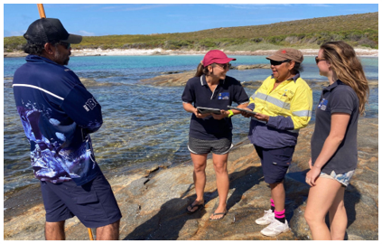

Nicole Hamre, Tim Langlois, Genevieve Phillips, Dave Guilfoyl, Jennifer Lavers, Sharnae Watson, Vanessa Adams, Charlotte Aston, Simon Bryars, Jeremy De Valck, Francisco Gelves-Gomez, Brooke Gibbons, Carol Martin, Daryl McPhee, Jonathan Mitchell, Emily Ogier, Rachel Przeslawski, Michelle Rose, Brooke Shields, Amanda Smith, Alaya Spencer-Cotton; <a href="mailto:matthew.navarro@uwa.edu.au">Matthew Navarro</a>

 

ETNTAC Rangers and UWA researcher conducting KAP Surveys on Wudjari Sea Country

<strong>Chapter citation:</strong> Hamre, Nicole; Langlois, Tim; Phillips, Genevieve; Guilfoyle, Dave; Lavers, Jennifer; Watson, Sharnae; Adams, Vanessa; Aston, Charlotte; Bryars, Simon; De Valck, Jeremy; Gelves-Gomez, Francisco; Gibbons, Brooke; Martin, Carol; McPhee, Daryl; Mitchell, Jonathan; Ogier, Emily; Przeslawski, Rachel; Rose, Michelle; Shields, Brooke; Smith, Amanda; Spencer-Cotton, Alaya; Navarro, Matthew. 2024. A field manual for marine protected area recreational user knowledge, attitude and practice (KAP) surveys. In <em>Field Manuals for Marine Sampling to Monitor Australian Waters</em>, <em>Version </em>1. Przeslawski R, Foster S (Eds). National Environmental Science Programme (NESP).

| Chapter Contents                                                                                                                                   |
|----------------------------------------------------------------------------------------------------------------------------------------------------|
|  **[Platform Description](https://kap-field-manual.github.io/platform-description)**                                                               |
|  **[Scope](https://kap-field-manual.github.io/scope)**                                                                                             |
|  **[Pre-survey preparations](https://kap-field-manual.github.io/pre-survey-preparations)**                                                         |   
|       _[Establish First Nations partnerships](https://kap-field-manual.github.io/pre-survey-preparations#establish-first-nations-partnerships)_    |
|       _[Develop survey instrument](https://kap-field-manual.github.io/pre-survey-preparations#develop-survey-instrument)_                          |
|       _[Design sampling plan](https://kap-field-manual.github.io/pre-survey-preparations#design-sampling-plan)_                                    |
|       _[Obtain approvals](https://kap-field-manual.github.io/pre-survey-preparations#obtain-approvals)_                                            |
|       _[Surveyor training](https://kap-field-manual.github.io/pre-survey-preparations#surveyor-training)_                                          |    
|  **[Field procedures](https://kap-field-manual.github.io/field-procedures)**                                                                       |
|  **[Analysis and release](https://kap-field-manual.github.io/analysis-and-release)**                                                               |
|  **[Demonstration of outputs](https://kap-field-manual.github.io/demonstration-of-outputs)**                                                       |
|  **[Acknowledgements](https://kap-field-manual.github.io/acknowledgements)**                                                                       |
|  **[Field Manual Maintenance](https://kap-field-manual.github.io/field-manual-maintenance)**                                                       |  
|  **[References](https://kap-field-manual.github.io/references)**                                                                                   |                  

<a href="#" class="scrollUpButton">Back to top</a>
